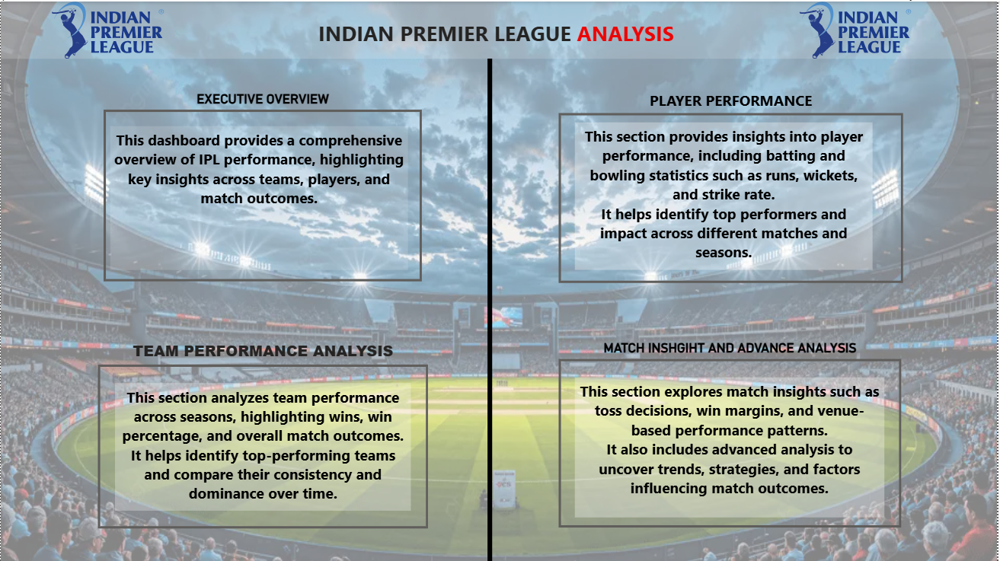
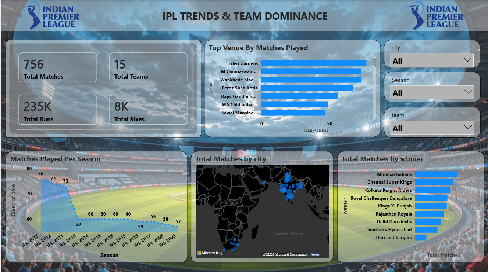
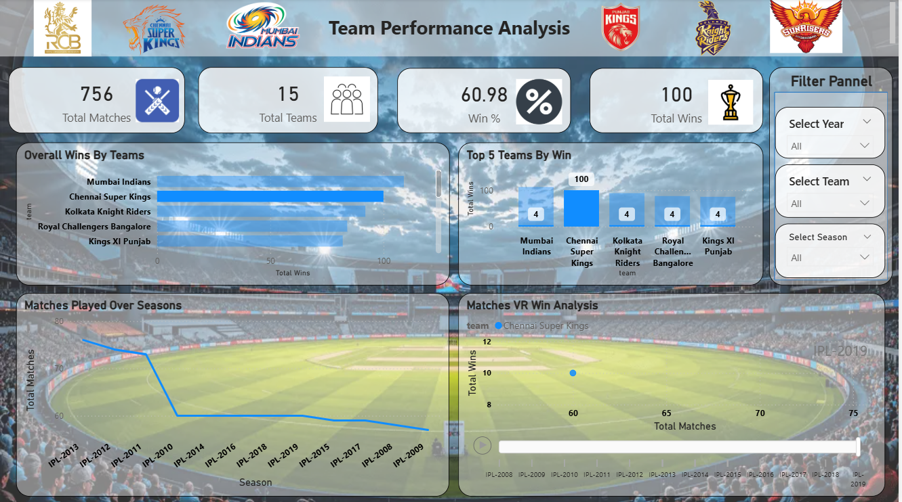
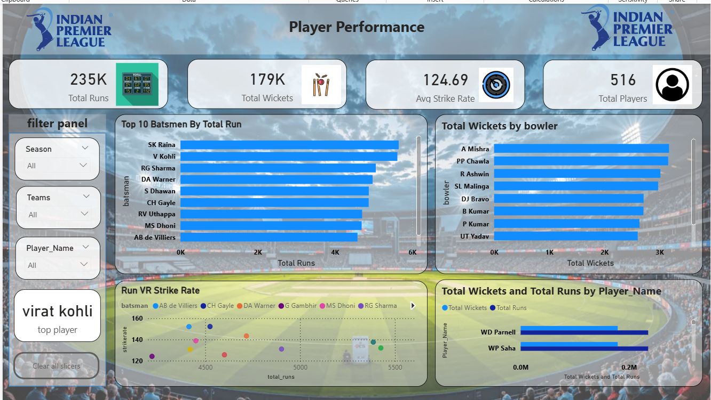
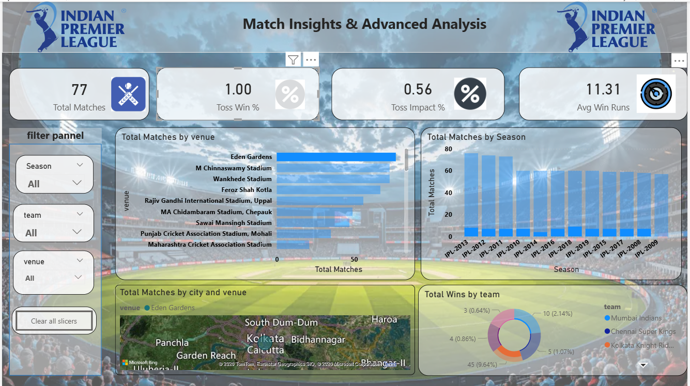

# 🏏 IPL Data Analytics Dashboard

## 📌 Overview
The **IPL Data Analytics Dashboard** is an interactive Business Intelligence project developed to analyze Indian Premier League (IPL) data using **Python, SQL, and Power BI/Tableau**. The dashboard transforms raw cricket datasets into meaningful insights related to team performance, player statistics, match outcomes, and season-wise trends.

This project demonstrates practical applications of **Data Analytics, Data Visualization, Time Series Analysis, Hypothesis Testing, and Business Intelligence** through an interactive and user-friendly dashboard.

---

# ❓ Problem Statement
IPL datasets contain massive amounts of match and player statistics, making manual analysis difficult and time-consuming. The objective of this project is to build an interactive dashboard that simplifies data exploration and helps identify meaningful trends, patterns, and performance insights through visualization and analytical techniques.

---

# 🎯 Project Objectives
- Analyze IPL team and player performance
- Build interactive KPI dashboards
- Perform time series trend analysis
- Apply hypothesis and graphical testing
- Generate data-driven insights
- Improve decision-making using Business Intelligence

---

# 🛠️ Tools & Technologies Used
- Python
- SQL
- Power BI / Tableau
- Excel
- Pandas
- NumPy

---

# 🧹 Data Cleaning & Preprocessing
- Handling missing values
- Removing duplicates
- Data transformation
- Feature engineering
- SQL-based data extraction

---

# 🔗 Data Modeling
The project includes optimized fact and dimension tables to improve dashboard performance and analytical efficiency. Relationships between match data, player data, and team statistics were created using proper relational modeling techniques.

---

# 📊 Dashboard Features
✅ Team Performance Analysis  
✅ Player Performance Analysis  
✅ Season-wise Trend Analysis  
✅ KPI Metrics & Interactive Filters  
✅ Match Result Insights  
✅ Time Series Analysis  
✅ Hypothesis & Graphical Testing  
✅ Dynamic Visualizations  

---

# 📸 Dashboard Screenshots

## 🏆 Dashboard Overview


---

## 📈 Ipl Trends And Team Dominance


---

## 👨‍💻 Team  Performance Analysis


---

## 📊 Player Performance Analysis


---

## 🧪 Match Insight And Advanced Analysis


---

# 📈 Time Series Analysis
Time series analysis was performed to identify season-wise trends and performance patterns across different IPL seasons. Historical data was analyzed to evaluate changes in scoring trends, win percentages, and player consistency over time.

---

# 🧪 Hypothesis & Graphical Testing
Hypothesis testing and graphical analysis techniques were used to validate assumptions and identify meaningful patterns within IPL datasets. Various charts and trend visualizations helped in interpreting analytical findings effectively.

---

# ✅ Key Insights
- Teams batting first showed stronger performance in specific venues
- Certain players maintained high consistency across seasons
- Team win percentages varied significantly across IPL seasons
- Interactive dashboards improved analytical storytelling and data exploration

---

# 🏁 Conclusion
The IPL Data Analytics Dashboard successfully transforms raw IPL datasets into meaningful business insights through interactive visualizations and analytical storytelling. This project enhanced practical skills in data analytics, SQL, dashboard development, and business intelligence.

---

# 📂 Project Structure

```bash
IPL-Data-Analytics-Dashboard/
│
├── Dataset/
├── Dashboard/
├── Images/
├── PPT/
└── README.md

```
---

# 📌 Tags
`#DataAnalytics` `#PowerBI` `#SQL` `#Python` `#IPL` `#Dashboard` `#SportsAnalytics` `#BusinessIntelligence` `#DataVisualization`